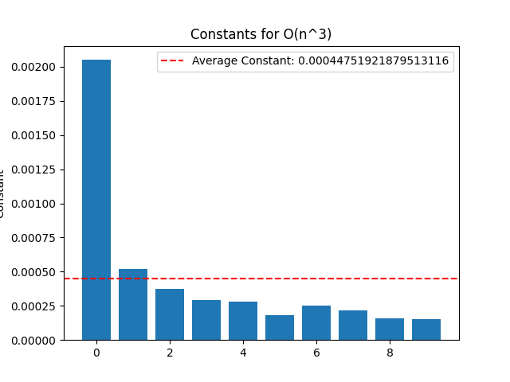
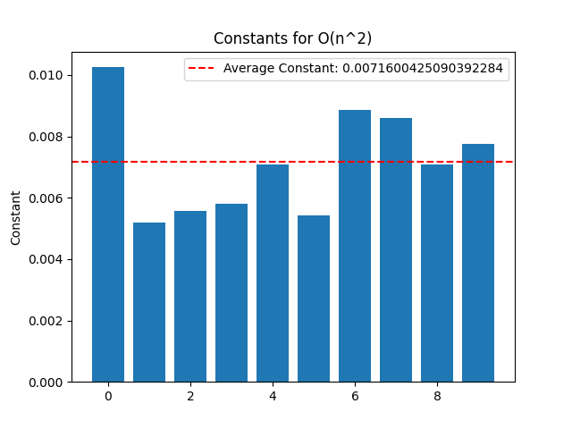
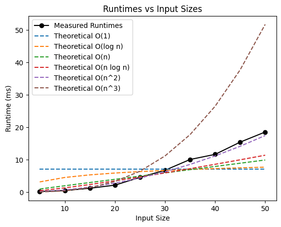
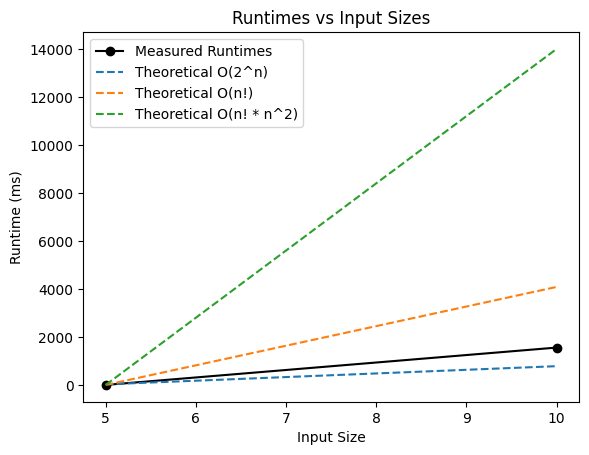
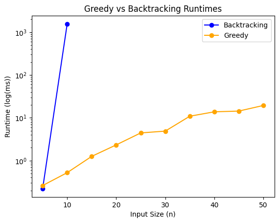
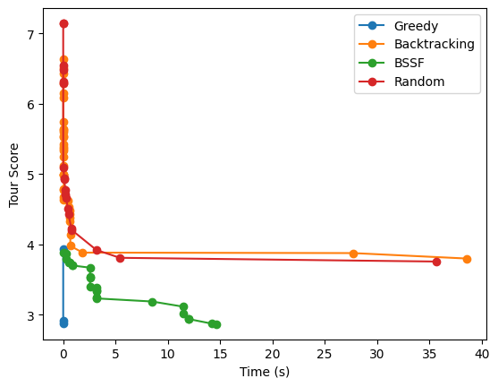
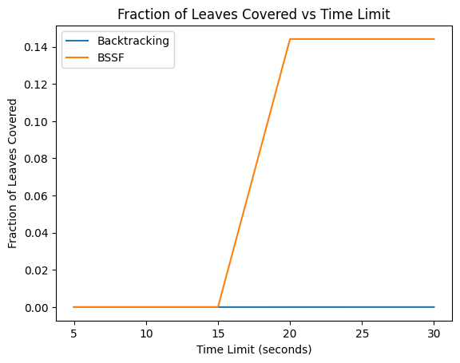
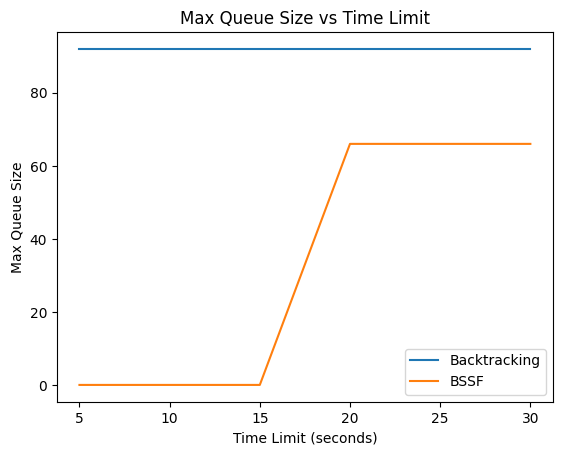
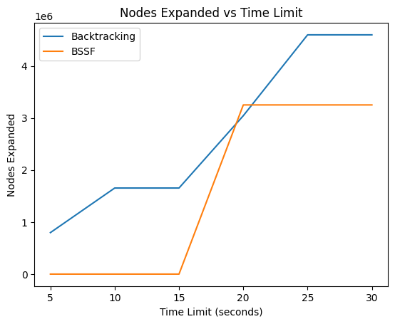
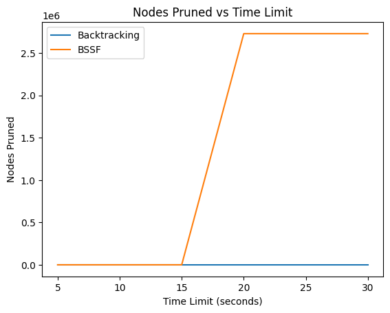

# Project Report - Backtracking

## Baseline

### Design Experience

Gabriel Pochman on 11/17/2025

For the greedy solution algorithm, I will simply iterate over every starting node to compute its corresponding SolutionStats. Of course, I will add a SolutionStats when it is better then every other SolutionStat that I have. Then, I will keep a list of nodes that I have visited. At a given traversal, I will ensure that the next node taken is the node with the smallest edge.

### Theoretical Analysis - Greedy

#### Time - **O(n^3)**

```py
def greedy_tour(edges: list[list[float]], timer: Timer) -> list[SolutionStats]:
    num_nodes = len(edges[0]) # O(1)
    stats = []
    global_best_score = math.inf
    for start_node in range(num_nodes): # O(n)
        path = [start_node]
        visited = set([start_node]) # O(n)
        current_node = start_node
        if timer.time_out():
            return stats
        process_start_node_greedy(edges, num_nodes, path, visited, current_node) # O(n^2) see below
        global_best_score = add_stat_greedy(edges, timer, stats, global_best_score, path) # O(n) see below
    return stats
```

Here, in our top level function, we iterate through all the nodes. For each node, we need to compute the minimum edges, which is linear because there are n entries in the adjacency list. Similarly, the function, process_starr_node_greedy (which does this, see below analysis) is quadratic. For that reason, this the total time complexity is **O(n^3)** because it effectively operates as a triple nested for loop.

```py
def process_start_node_greedy(edges, num_nodes, path, visited, current_node): # O(n^2)
    while len(visited) < num_nodes: # O(n^2) see below
        valid_nodes = set() # (1)
        for node in range(num_nodes): # O(n)
            if node not in visited and not math.isinf(edges[current_node][node]): #O(1)
                valid_nodes.add(node)
        if not valid_nodes:
            break
        curr_min = math.inf
        for node in valid_nodes: # O(n)
            if edges[current_node][node] < curr_min: # O(1)
                curr_min = edges[current_node][node]
                best_node = node
        path.append(best_node) # O(1)
        visited.add(best_node) # O(1)
        current_node = best_node
```

As you can see, the top level while loop here will run n times if there is a valid solution from that starting node. This is because its starts with only the starting node in the visited set. Furthermore, we need to find the minimum edge to choose, which must be a linear operation because of our adjacency list representation. Technically here we have a 2n because my implementation iterates over it twice, but O(n) = O(2n). So we have O(2n * n) = O(n^2) for this function.

```py
def add_stat_greedy(edges, timer, stats, global_best_score, path): # O(n)
    if len(path) != len(edges): # O(1)
        return global_best_score
    cost = score_tour(path, edges) # O(n)
    if cost < global_best_score: # O(1)
        global_best_score = cost
        stat: SolutionStats = SolutionStats(tour=path,
                                               score=cost,
                                               time=timer.time(),
                                               max_queue_size=0,
                                               n_nodes_expanded=0,
                                               n_nodes_pruned=0,
                                               n_leaves_covered=0,
                                               fraction_leaves_covered=0.0)
        stats.append(stat)
    return global_best_score
```

This function is quite trivial. All it does is compute the score of the tour if it is a solution and adds it so the solution set. computing the score_tour is actually a linear operation (I assume; I didn't write it but that makes sense). That makes this whole function linear.

So, we have O(n * (n + n^2 + n)) = O(n * (2n + n^2)) = O(n^3). The final time complexity is therefore **O(n^3)**.

#### Space - **O(n^2)**

```py
def greedy_tour(edges: list[list[float]], timer: Timer) -> list[SolutionStats]: # O(n^2) edges list
    num_nodes = len(edges[0]) # O(1)
    stats = []
    global_best_score = math.inf # O(1)
    for start_node in range(num_nodes): # O(1)
        path = [start_node] # O(n)
        visited = set([start_node]) # O(n)
        current_node = start_node # O(1)
        if timer.time_out():
            return stats
        process_start_node_greedy(edges, num_nodes, path, visited, current_node)
        global_best_score = add_stat_greedy(edges, timer, stats, global_best_score, path)
    return stats
```

The adjacency list of edges is O(n^2) in space complexity because its square structure. Under other implementations it would be less, but that's what we were given. This for loop will garbage collect all internal variables. The timer itself is clearly constant because we only pass around a single reference of it.

However, both the path list and the visited set will grow to size n before they are garbage collected.

```py
def process_start_node_greedy(edges, num_nodes, path, visited, current_node): # O(n) for the path, visited, and valid_nodes
    while len(visited) < num_nodes: # O(n)
        valid_nodes = set()
        for node in range(num_nodes): # O(1) range, see my opinion below
            if node not in visited and not math.isinf(edges[current_node][node]):
                valid_nodes.add(node) # O(n)
        if not valid_nodes:
            break
        curr_min = math.inf
        for node in valid_nodes: # O(n) valid nodes
            if edges[current_node][node] < curr_min:
                curr_min = edges[current_node][node]
                best_node = node
        path.append(best_node) # O(n) path
        visited.add(best_node) # O(n) visited
        current_node = best_node
```

I'm not including the edges adjacency list because its passed by reference as a mutable object, not by copy.

Here we see on the first line that the visited set does in fact grow to O(n). My understand of ranges is that they are iterable objects that don't immediately store all their values, so I believe that ranges themselves are constant because they generate values as they yield them (I could be wrong though. It wont affect this anyways).

The valid_nodes set could also have up to n elements in it. However, the while loop garbage collects the valid_nodes set at each iteration so it doesn't stack up to a memory cost of more than n. So, this function should be O(n) in space complexity.

```py
def add_stat_greedy(edges, timer, stats, global_best_score, path): # O(1)
    if len(path) != len(edges): # O(1)
        return global_best_score
    cost = score_tour(path, edges) # O(1) assuming this was implemented correctly
    if cost < global_best_score: # O(1)
        global_best_score = cost # O(1)
        stat: SolutionStats = SolutionStats(tour=path,   # O(1) independently in this function, see my explanation below
                                               score=cost,
                                               time=timer.time(), # O(1)
                                               max_queue_size=0,
                                               n_nodes_expanded=0,
                                               n_nodes_pruned=0,
                                               n_leaves_covered=0,
                                               fraction_leaves_covered=0.0)
        stats.append(stat)
    return global_best_score
```

I say that this function is O(1) in space not because it doesn't contain any linear data structure, but because it only contributes O(1) to the overall space complexity of the algorithm. As I said before, the edges list is simply referenced, not copied. Similarly, the path list is only referenced. Even when the path is put into the SolutionStats object, I believe that it is still only passing a reference.

To sum up. The dominating factor for space complexity here is the edges adjacency list. For that reason, the space complexity is **O(n^2)**.

### Empirical Data - Greedy

| N   | reduction | time (ms) |
|-----|-----------|-----------|
| 5   | 0         |    0.26   |
| 10  | 0         |     0.52  |
| 15  | 0         |     1.25  |
| 20  | 0         |      2.32 |
| 25  | 0         |      4.42 |
| 30  | 0         |      4.87 |
| 35  | 0         |      10.86|
| 40  | 0         |  13.76    |
| 45  | 0         |  14.33    |
| 50  | 0         |   19.37   |

### Comparison of Theoretical and Empirical Results - Greedy

- Theoretical order of growth: **O(n^3)**
- Empirical order of growth (if different from theoretical): **O(n^2)**



As you can see, the theoretical constants were very inconsistent.



However, the constants for quadratic time fit the empirical data much better



According to this, you see that the empirical nearly perfectly follows quadratic time. I'm not sure why the theoretical of O(n^3) was incorrect in favor of O(n^2) here. One theory that I have is the process_start_node_greedy function. It effectively operates on a double nested for loop in the worst case.

I think that the iteration through only 50 nodes was negligible there because it was such a small number. That's the best theory I have to explain the discrepancy.

## Core

### Design Experience

Gabriel Pochman on 11/17/2025

To implement the backtracking TSP problem, I will simply do what the pseudocode does. However, my stack will be a list which I will pop and push from using pop and append, respectively. Each partial path will simply be a list. I'll push a path 0 onto the stack and then start a while loop. After popping a path off the stack, if it is not a solution, I will expand all its child paths b iterating through each vertex that has not been explored by the parent and adding it to the parent (making unique copies of the parent). For each of those, I'll check if its a solution, if so, I'll add it to the solutions list if its better than the ones currently in there. If its not a solution, I add it to the stack.

I will then return the list of solutions when the stack runs out. Of course, if the time runs out I will return early.

### Theoretical Analysis - Backtracking

#### Time - **O(n! * n^2)**

```py
def backtracking(edges: list[list[float]], timer: Timer) -> list[SolutionStats]:
    stats = []        # O(1)
    stack = [[0]]  # (1)
    global_best_score = math.inf
    while stack and not timer.time_out(): # See explanation
        path = stack.pop()
        child_paths = expand_path(edges, path) # O(n^2) see below
        for child_path in child_paths:  # Expansion child vetting loop O(n^2)
            global_best_score = vet_child_path_backtracking(edges, stats, stack, # O(n)
                                                            child_path, global_best_score, timer)
    return stats
```

I'll do mostly reasoning for this. Performing the expansion itself is an n^2 operation (see my reasoning for that function below). On any given expansion, we will have at most about n child expansion. Because of that, the expansion child vetting loop runs at most n times. Because vetting a child path is linear, the expansion child vetting loop contributes O(n^2).

This expansion and child vetting process runs for each item that gets added to the stack. We want to determine how many times this while loop will run because it is the number of expansions that we perform. The number of expansions that we perform is roughly equal to the number of partial states (which is the number added to the stack).

We start with just a single partial state. This single partial state expands into n-1 partial states in the worse case. Again, in the worst case, each of those partial states expands into n-2 partial states. It seems that the number of partial states in the worse case should be represented by the series: (n-1)(n-2) ... 1. This series is known as the factorial, represented as n! Therefore, in the worst case there are n! partial states.

Each partial state runs O(n^2) computations, so our final time complexity here is **O(n! * n^2)**.

```py
def vet_child_path_backtracking(edges, stats, stack, child_path, global_best_score, timer) -> int: # O(n)
    if len(child_path) == len(edges):
        cost = score_tour(child_path, edges) # O(n) linear to score
        if cost < global_best_score: # O(1)
            global_best_score = cost
            stat: SolutionStats = SolutionStats(tour=child_path,
                                               score=cost,
                                               time=timer.time(),
                                               max_queue_size=0,
                                               n_nodes_expanded=0,
                                               n_nodes_pruned=0,
                                               n_leaves_covered=0,
                                               fraction_leaves_covered=0.0)
            stats.append(stat)
    else:
        stack.append(child_path) # O(1)
    return global_best_score
```

This function is almost the same as the previous phase. The driving factor here in time is the score_tour function. That function is linear, which makes this overall vetting function linear.

```py
def expand_path(edges: list[list[float]], path: Tour) -> list[Tour]: # O(n^2)
    child_paths = []
    for node in range(len(edges)): # iterates n times
        if node not in path and not math.isinf(edges[path[-1]][node]): # O(1)
            new_path = path + [node]  # O(n) it performs a copy
            child_paths.append(new_path)
    return child_paths
```

Here, we see a for loop that iterates at most n times. In each loop, it has the possibility of copying a list of length n. This means that it effectively operates as a double nested for loop, making this function O(n^2).

Overall, we see (for reasons explained above) that the time complexity for this implementation of the TSP problem is **O(n! * n^2)**.

#### Space

```py
def backtracking(edges: list[list[float]], timer: Timer) -> list[SolutionStats]: # O(n^3)
    stats = [] 
    stack = [[0]] # O(n^3)see my reason on the stack size
    global_best_score = math.inf
    while stack and not timer.time_out(): 
        path = stack.pop()
        child_paths = expand_path(edges, path) # O(n^2) n paths n long
        for child_path in child_paths: # O(n) because of for loop garbage collection
            global_best_score = vet_child_path_backtracking(edges, stats, stack, # O(n)
                                                            child_path, global_best_score, timer)
    return stats
```

The edges are the same as before at O(n^2). When we expand, the child_paths list is also O(n^2) because there are at most n paths of at most n long. However, these child paths are garbage collected at each iteration of the for loop. The vetting function is only O(n) at the worst, which makes that for loop effectively O(n) because of garbage collection.

We must determine the ultimate size of the stack. Of course, we have determined that there are n! partial states, but does the stack necessarily grow to that?

Consider the following, from our first partial state, we receive (n-1) partial states that will all be added to the stack because they are not complete solutions. One of those new states will be popped off and expanded to produce n-2 partial states that will all be added to the stack. One of those popped will produce n-3 and add them to the stack. You get the idea. This is more of a depth first search because we don't expand every partial state all at once before finishing.

At the bottom of a solution of out DFS tree, the stack has at most (n-1) + (n-2) + (n - 3) + ... + 0 paths in it. Consider also that the sizes of those paths are 1, 2, 3 ... n respectively. Our theoretical largest size of the stack is then 1(n-1) + 2(n-2) + 3(n - 3) + ... + n(1). The explicit formula for such a series is a polynomial expression whose highest order term is (1/6) * (n^3). In terms of big O, we simplify that to be O(n^3). This is the driving factor at play here.

```py
def vet_child_path_backtracking(edges, stats, stack, child_path, global_best_score, timer) -> int:
    if len(child_path) == len(edges): # O(1)
        cost = score_tour(child_path, edges) # O(n)
        if cost < global_best_score:
            global_best_score = cost
            stat: SolutionStats = SolutionStats(tour=child_path, # O(n)
                                               score=cost,
                                               time=timer.time(),
                                               max_queue_size=0,
                                               n_nodes_expanded=0,
                                               n_nodes_pruned=0,
                                               n_leaves_covered=0,
                                               fraction_leaves_covered=0.0)
            stats.append(stat)
    else:
        stack.append(child_path) # O(n)
    return global_best_score
```

This is quite simple. We have already accounted for the edges. The largest data structure in this function is the child path itself. It was technically already counted but it doesn't make a different to include it in this function. That makes this function linear.

```py
def expand_path(edges: list[list[float]], path: Tour) -> list[Tour]: #O(n^2)
    child_paths = [] # O(n^2)
    for node in range(len(edges)):
        if node not in path and not math.isinf(edges[path[-1]][node]):
            new_path = path + [node]
            child_paths.append(new_path)
    return child_paths
```

Remember that each expansion creates at most n partial states. Because of this, the child_paths data structure is what were concerned with here. There are n elements in each child_path and n different paths, which makes this function clearly O(n^2)

Overall, we see that the driving factor in space complexity is the polynomial series that grows the size of the stack. For that reason this algorithm in **O(n^3)** in space complexity.

### Empirical Data - Backtracking

| N   | reduction | time (ms) |
|-----|-----------|-----------|
| 5   | 0         |    0.22   |
| 10  | 0         |   1556.17 |
| 15  | 0         |    >60000 |
| 20  | 0         |    >60000 |
| 25  | 0         |    >60000 |
| 30  | 0         |    >60000 |
| 35  | 0         |    >60000 |
| 40  | 0         |    >60000 |
| 45  | 0         |    >60000 |
| 50  | 0         |    >60000 |

### Comparison of Theoretical and Empirical Results - Backtracking

- Theoretical order of growth: **O(n! * n^2)**
- Empirical order of growth (if different from theoretical): **O(2^n)**



As you can see, my theoretical runtime of n! * n^2 was astronomically off. The lack of data meant that the constant comparison was all over the place because there were only two data points. The empirical data was closer to the O(2^n) order.

The main reason for this, in my opinion, is the lack of data. Its really difficult to draw a conclusion from only two runtimes. However, assuming that this is the case, there's a perfectly plausible reason why. In my analysis for the top level backtracking, I assumed the worst case, which would be that there were no infinities in the graph. 

My understanding of the graph generation algorithm (assuming that it's consistent with the test cases) is that there may be edges with infinite weight. This dramatically decreases the search space because you don't need to expand to all (partial state number - 1) more partial state on each stack popping. This seems to be the most plausible reason why my theoretical didn't match the empirical data.

### Greedy v Backtracking



I log transformed the data here to be able to see variation easier. With that, you can easily see that the greedy algorithm performs **substantially** faster than the backtracking algorithm.

The main difference between the two algorithms that I notice is the number of states that they expand to search. It's clear that the number of searched states increases exponentially (perhaps even more) as the input size increases. However, because the greedy algorithm does not search all possible states, it fares far better in such a comparison because its search space growth is polynomial.

### Water Bottle Scenario 

#### Scenario 1

**Algorithm:** 

I would use the BSSF algorithm from stretch 1. This is because my Boss said that he needs an optimal solution, so greedy will not suffice. I feel like the regular backtracking wouldn't make sense because it wastes time exploring paths that don't need to be explored. To the contrary, BSSF only explores paths that are not already sub-optimal. There isn't a need to modify BSSF, it should work just fine.

#### Scenario 2

**Algorithm:** 

Because the Boss said that time was more important than accuracy, I would choose the greedy algorithm. This will produce a reasonable solution in a polynomial-scaled amount of time. Because only 40 percent of the edges are actually present, I would move to have the graph represented as adjacency list to save on memory and the time to compute the minimum edge. This because with the matrix, you are required to iterate over all the infinity weight edges, which is inefficient.

#### Scenario 2

**Algorithm:** 

I'm going to assume that was supposed to say scenario 3. Because my Boss wants the best solution, I would use BSSF. There still isn't a good reason to choose the generic brute force backtracking algorithm because it explores unnecessary paths.

I would modify the algorithm by representing the graph as an adjacency list instead of a matrix because there are only 10% of the edges. This will greatly reduce both the space complexity and the time it takes to compute the expansion.


## Stretch 1

### Design Experience

Gabriel Pochman on 11/17/2025

This will be very similar to my other backtracking implementation. The initial best path will be computed by using the greedy algorithm instead of assuming a default cost of infinity. Also, when I evaluate a child path (that has just been expanded to), if its not a solution I will check to make sure that its current cost isn't already more than (or equal to perhaps) than the best path. If so, I will cease that path and not add it to the stack.

Other than those two differences, this stretch should be a carbon copy of the previous one.

### Demonstrate BSSF Backtracking Works Better than No-BSSF Backtracking 

For Size = 10, Seed = 200, Time limit = 60 seconds, Optimal Score = 2.806

Backtracking arrives at the optimal solution in 0.906715 seconds
BSSF arrives at the optimal solution in 0.045704 seconds

### BSSF Backtracking v Backtracking Complexity Differences

Its clear that BSSF likely has a better average case time complexity that Backtracking. However, I'm not entirely sure that we can say that their worst case time complexities are necessarily different. If there exists a graph (at every possible size) that will result in the BFFS algorithm never having enough information to prune a part of the search space, then their worst case Big O time complexities should be the same.

Because of this, my theoretical complexity from Backtracking to Backtracking BFFS has not changed because we are dealing with this worst case. If, however, someone could prove that you will always be able to prune a certain portion of a particular graph traversal tree in such a way that would impact Big O, then I would be convinced.

### Time v Solution Cost



This analysis was run for nodes = 15 for 60 seconds each. These results are quite surprising to me. As you can see, the BFFS algorithm appears to be winning the time vs score ratio over 2 of the algorithms. Its interesting how the randomization and and backtracking seem to be at a standstill for quite some time. Oddly, The greedy algorithm performed amazingly well. It arrived at a very good solution faster than any of the other algorithms. It seems that using the greedy algorithm will get far better results faster than any of the other algorithms could.

## Stretch 2

### Design Experience

Gabriel Pochman on 11/17/2025

We talked about the CutTree class and the additional fields in utils. I looked at the CutTree class and the additional metrics inside the utils source file. It seems like the idea here is to see how much of the solution search space was actually covered by the BSSF algorithm. Of course the generic one would cover everything, but BSSF should result in some cuts to narrow down the search space. My plan for implementing the new fields is to use the CutTree class as I go and call the coverage and leaves cut methods at the end to fill out those fields.

### Cut Tree

The CutTree class takes the number of Nodes in the TSP graph. Then you can call cut on it. What that does is, it determines the number of leaves that were cut (or covered) by nature of the path you have chosen. The CutTree class assumes that we are doing a Depth First Search style thing. The interesting thing to see here would be if BFFS is able to cut more leaves in a shorter amount of time than Backtracking. If so, it would prove that BFFS covers (cuts) the search space more efficiently.

The cut function works by finding the terminal node in the graph by walking its way down the path you supply it. It then compute the number of leaves cut by using the factorial. It then updates all the leaves with how many were cut at this path modification. It's a really cool class that lets you quantify the extent of your graph traversal.

### Plots 

I ran my testing here with variable time limits to see how effectively both algorithms would utilize the search space. Note that the first three times yielding nothing for BSSF because it was unable to find something better than the greedy solution in that time. Also note that some solutions are the same for certain time intervals because the expansion evaluation process often took more than 5 seconds as you got up there.



As you can see, the tree coverage was significantly higher for the BFFS algorithm. Note that the jump is likely artificial because BFFS didn't get a better result than greedy in the first three. The fine print coverage fraction actually for backtracking had the coverage at less than a percent! It goes to show that pruning the search space make the search move a lot faster.



We see what we would expect to see here. The backtracking had substantially more partial states active at a time because it was not pruning off fruitless ones. It shows that the brute force of pure backtracking results in substantial overheads with storing partial states.



This is also what we would expect. It shows that backtracking resulted in substantially more expansions. This is likely because the time that backtracking spent expanding into more states was spent by BFFS to prune nodes and explore new paths. It's interesting how more expansion does not equal more coverage.



Here we see the obvious. The backtracking algorithm does not prune nodes. To the contrary, the BFFS algorithm does. This is precisely why we see the discrepancies between the two in the other graph. BFFS pruned around 2.5 million nodes that the backtracking algorithm would have had to fully expand. Here we see why pruning is a practical necessity.

## Project Review

Gabriel Pochman and Sam Bills on 11/19/2025

For Baseline, we all got similar theoretical orders (cubic). However, we all saw that the empirical time complexity was n^2. We all weren't sure as to why there was this discrepancy in the theoretical order vs the actual order. They had some theories that it was due to lower level optimizations in the actual computer processor.

For Core, we all got some variation of O(n!) for the theoretical. For them, they also got O(n!) in the empirical, but I was the only one got got O(2^n) for that. I wasn't sure why this was the case, but it could be because we all only had like two data points.

For stretch 1, we implemented BFFS in similar ways. We saw that backtracking generally had the lowest efficiency in terms of solution quality per second the algorithm was running. For stretch 2, we also saw that BFFS was able to provide more coverage on the tree than backtracking. This makes sense because it searches the space more effectively.

All in all, this was a really cool project. I enjoyed learning about these different algorithms and seeing how difficult TSP is to solve efficiently.